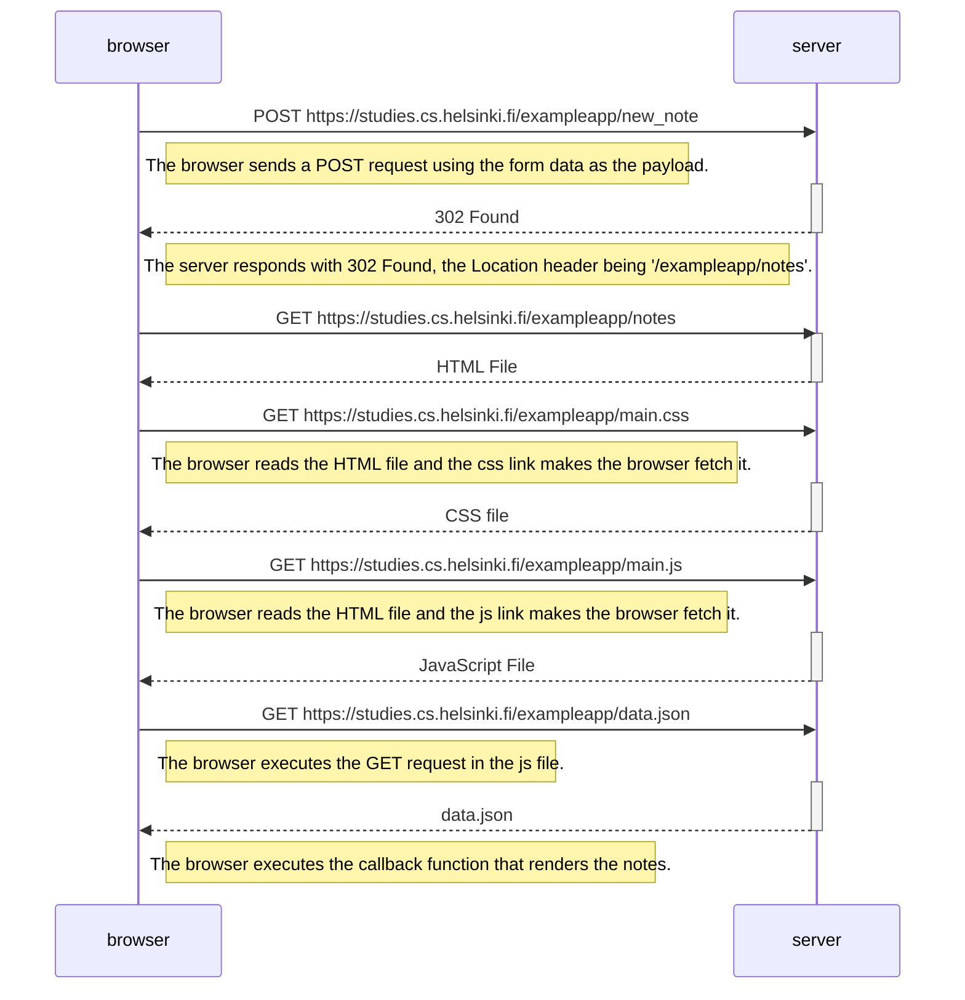

```mermaid
sequenceDiagram
    participant browser
    participant server

    browser->>server: POST https://studies.cs.helsinki.fi/exampleapp/new_note

    Note right of browser: The browser sends a POST request using the form data as the payload.

    activate server
    server-->>browser: 302 Found
    deactivate server

    Note right of browser: The server responds with 302 Found, the Location header being '/exampleapp/notes'.

    browser->>server: GET https://studies.cs.helsinki.fi/exampleapp/notes

    activate server
    server-->>browser: HTML File
    deactivate server

    browser->>server: GET https://studies.cs.helsinki.fi/exampleapp/main.css

    Note right of browser: The browser reads the HTML file and the css link makes the browser fetch it.

    activate server
    server-->>browser: CSS file
    deactivate server

    browser->>server: GET https://studies.cs.helsinki.fi/exampleapp/main.js

    Note right of browser: The browser reads the HTML file and the js link makes the browser fetch it.

    activate server
    server-->>browser: JavaScript File
    deactivate server

    browser->>server: GET https://studies.cs.helsinki.fi/exampleapp/data.json

    Note right of browser: The browser executes the GET request in the js file.

    activate server
    server-->>browser: data.json
    deactivate server

    Note right of browser: The browser executes the callback function that renders the notes.

```
