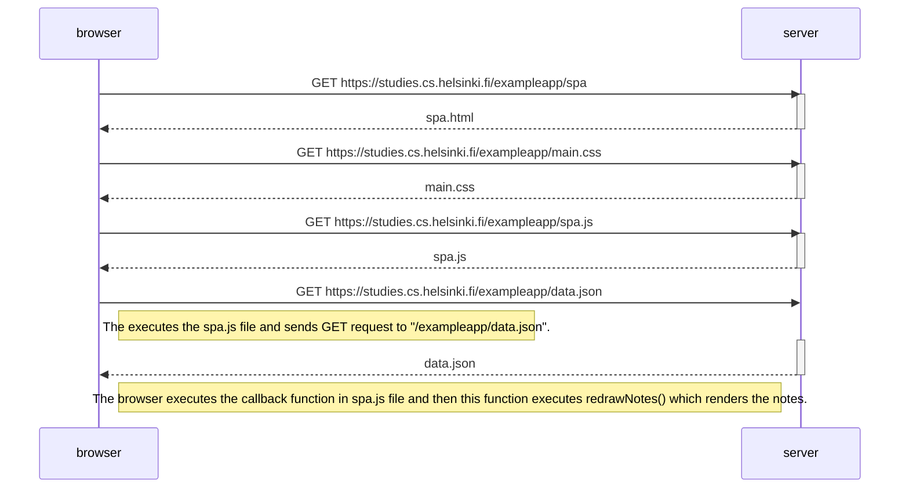

```mermaid
sequenceDiagram
    participant browser
    participant server

    browser->>server: GET https://studies.cs.helsinki.fi/exampleapp/spa

    activate server
    server-->>browser: spa.html
    deactivate server

    browser->>server: GET https://studies.cs.helsinki.fi/exampleapp/main.css

    activate server
    server-->>browser: main.css
    deactivate server

    browser->>server: GET https://studies.cs.helsinki.fi/exampleapp/spa.js

    activate server
    server-->>browser: spa.js
    deactivate server

    browser->>server: GET https://studies.cs.helsinki.fi/exampleapp/data.json

    Note right of browser: The executes the spa.js file and sends GET request to "/exampleapp/data.json".

    activate server
    server-->>browser: data.json
    deactivate server

    Note right of browser: The browser executes the callback function in spa.js file and then this function executes redrawNotes() which renders the notes.
```
