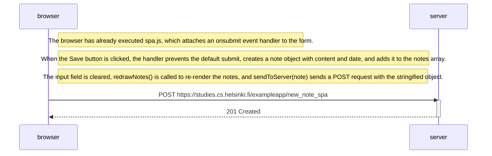

```mermaid
sequenceDiagram
    participant browser
    participant server

    Note right of browser: The browser has already executed spa.js, which attaches an onsubmit event handler to the form.

    Note right of browser: When the Save button is clicked, the handler prevents the default submit, creates a note object with content and date, and adds it to the notes array.

    Note right of browser: The input field is cleared, redrawNotes() is called to re-render the notes, and sendToServer(note) sends a POST request with the stringified object.

    browser->>server: POST https://studies.cs.helsinki.fi/exampleapp/new_note_spa

    activate server
    server-->>browser: 201 Created
    deactivate server
```
